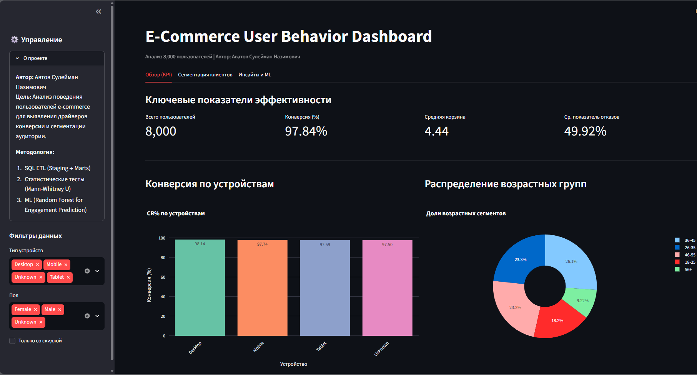
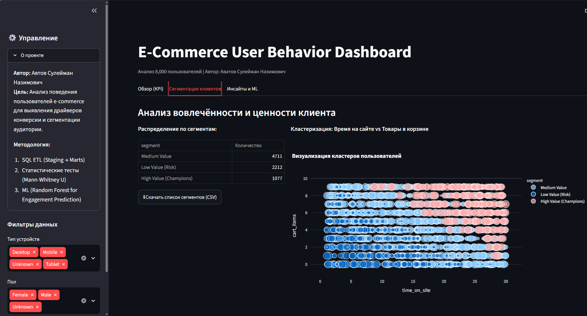
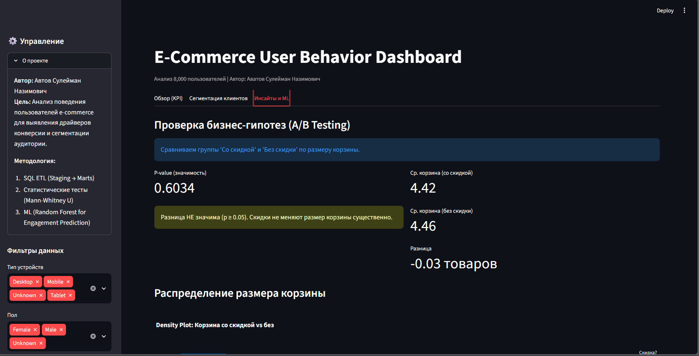

# 🛒 E-Commerce User Behavior Analysis & Retention Modeling

**Автор:** Автов Сулейман Назимович  
**Дата:** Сентябрь 2026  
**Стек технологий:** Python (Pandas, Scikit-Learn, SciPy), SQL (SQLite), Streamlit, Plotly  

## 🎯 О проекте
Комплексный анализ поведения пользователей интернет-магазина с целью выявления драйверов конверсии, сегментации аудитории по уровню вовлеченности и построения предиктивной модели для идентификации высокопотенциальных клиентов.

Проект демонстрирует полный цикл Data Analyst'а: от очистки сырых данных и создания витрин в SQL до статистической проверки гипотез, машинного обучения и визуализации результатов в интерактивном дашборде.

## 🚀 Live Demo
👉 **[Интерактивный дашборд (Streamlit Cloud)](ССЫЛКА_НА_ДЕПЛОЙ)**  
*(Приложение развернуто на платформе Streamlit Community Cloud. Первая загрузка может занять до 60 секунд)*

---

## 📸 Галерея дашборда

Ниже представлены ключевые экраны аналитического интерфейса. Для полноценной работы с фильтрами используйте живую версию выше.

| Обзор KPI | Сегментация клиентов | Инсайты и ML |
| :---: | :---: | :---: |
|  <br> **1. Ключевые метрики**<br>*Общая конверсия, средний чек и динамика по устройствам.* |  <br> **2. Кластеризация пользователей**<br>*Разделение на Champions/Risk на основе Engagement Score.* |  <br> **3. Статистика и Моделирование**<br>*Проверка гипотез о скидках и важность признаков (Feature Importance).* |

*(Дополнительные детальные скриншоты доступны в папке `assets/`: `tab2_segments_2.png`, `tab3_insights_2.png`, `tab3_insights_3.png`)*

---

## 💼 Ключевые бизнес-инсайты

На основе анализа 8,000+ записей были сделаны следующие выводы:

1.  **Эффективность скидок переоценена:**
    *   Тест Манна-Уитни (**p-value = 0.60**) показал отсутствие значимой разницы в размере корзины между группами со скидкой и без неё.
    *   **Рекомендация:** Использовать скидки как триггер завершения сделки, но не ожидать роста AOV. Для апселла необходимы бандлы или пороги бесплатной доставки.

2.  **Поведение важнее демографии:**
    *   Модель Random Forest выявила, что метрики текущей сессии (`pages_viewed`, `time_on_site`) являются более сильными предикторами высокой вовлеченности, чем возраст или пол.
    *   **Инсайт:** Таргетирование должно строиться на real-time поведенческих триггерах.

3.  **Сегмент "At Risk" — главный резерв роста:**
    *   ~40% аудитории относятся к группе низкой вовлеченности. Удержание даже 5-10% этих пользователей может увеличить выручку на 3-5%.

---

## 🏗 Архитектура решения

Проект построен по модульному принципу, разделяющему логику обработки данных, аналитику и визуализацию.

```text
ecommerce-behavior-analysis/
├── app.py                  # Интерактивный дашборд (Streamlit)
├── requirements.txt        # Зависимости Python
├── data/                   # Исходные и очищенные данные
│   ├── ecommerce_clean.csv # Основной датасет для дашборда
│   └── ml_top_feature_engagement.csv # Результаты ML-модели
├── sql/                    # Логика трансформации данных (ETL)
│   ├── 01_stg_ecommerce_users.sql   # Очистка и типизация
│   ├── 02_mart_user_segments.sql    # RFM-подобная сегментация
│   └── ...                          # Витрины для BI
├── src/                    # Python-скрипты пайплайна
│   ├── run_pipeline.py     # Автоматизация загрузки и SQL-трансформаций
│   └── load_data.py        # Работа с базой SQLite
├── analysis/               # Отчеты и выводы
│   ├── EXECUTIVE_SUMMARY_SQL.md
│   └── EXECUTIVE_SUMMARY_ML.md
└── assets/                 # Скриншоты для документации
    ├── tab1_kpi_overview.png
    ├── tab2_segments_*.png
    └── tab3_insights_*.png